Pour une bonne lecture de cette doc sur VSCode, installez l'extension plantUML(jebbs.plantuml).

# VTX

# VTX_UTIL

## Présentation

# VTX_CORE

# VTX_CORE

# VTX_APP

## Présentation

Le module App s'occupe de gérer les articulations entre les structures de Core et le renderer, ainsi que de gérer plusieurs systèmes structurant le logiciel VTX.

Il est scindé en plusieurs dossiers en fonction du niveau d'accessibilité des features.

- "core" contient les structures abstraites et minimales des différents systèmes présent dans App.

- "application" contient les systèmes ayant attrait à l'application VTX.

- "component" contient l'ensemble des components utilisé par l'ECS

- "entity" contient les fonctions pour générer les entités complexe possédant plusieurs composants intéragissant entre-eux.

- "internal" contient des paramétrisations ou des actions utilisants les systèmes de "application" spécifique à VTX (i.e la liste des settings de VTX, les fonctions de serialisation, etc)

- "helper" contient des fonctions utilitaire pour factoriser des fonctionnalités un peu plus poussé.

- "action" contient les différentes action permise par VTX. Les actions sont les fonctionnalités que peux lancer l'utilisateur dans le logiciel.

Outre ces dossiers, app contient deux fichiers à sa racine : vtx_app, qui est le point d'entrée et le coeur du module, et info qui des données statiques informant sur la version de VTX.

## Architecture

Globalement le module VTX_APP est composé de systèmes plus ou moins indépendants centralisés dans un SystemHandler afin que l'environnement VTX puisse facilement être partagé dans l'environnement Python. Le singleton VTXApp s'occupe de stocker le SystemHandler et de gérer l'initialisation, la boucle logique et la destruction du logiciel.
Parmi les systèmes, on peut notamment recenser la scène, l'entity component system, le serializer, l'action manager...

### Structure d'un système

Chaque système hérite de BaseSystem et possède un membre static "SystemRegistration" lui permettant de s'enregistrer automatiquement et directement auprès du SystemHandler. Chaque système possède une ou plusieurs fonction facilitatrice pour accéder facilement dans le code aux features désirées. (par exemple, le système ECS possède une fonction pour accéder au registre, une fonction pour accéder à l'entityBuilder et une fonction pour accéder aux metafonctions des components)

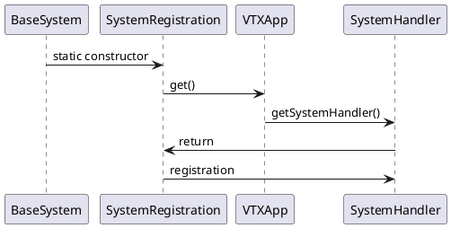

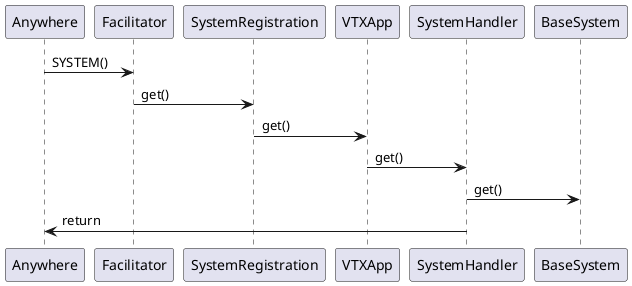

### Liste des systèmes

La fonctionnalité principale de VTX est de faire du rendu de molécule. Ceci va être fait via l'utilisation de 3 systèmes principaux : Le renderer, la scène et l'entity component system.

#### RENDERER()

Le renderer permet l'accès aux features du module VTX_RENDERER via la classe VTX::Renderer::Facade. Un petit système est mis en place pour appeler des callbacks avant d'accéder et release l'accès au renderer pour gérer l'activation du context openGL.

RENDERER() permet un accès simplifié à la facade en intégrant l'appel des callbacks d'accès.
RENDERER_SYSTEM() permet d'accéder directement au système et potentiellement au renderer sans passé par les callbacks.

#### SCENE()

Dans VTX, la scène n'est en fait qu'un ensemble de fonctions facilitatrice pour pouvoir accéder aux objets de scène (Entity possédant un component "SceneItemComponent"). Sa fonction d'update va permettre la mise à jour de l'état des différents SceneItemComponent.

#### ECS

l'Entity Component System (ECS) est un système permettant de stocker, de lier des components à des entity et de construire des système complexes (et modulaire) par composition.

Nous utilisons la lib EnTT pour gérer ça.
EnTT implémente l'ECS en 3 parties
- Les entités (entt::entity) : Dans les faits, c'est juste un id unique
- Les composants : dans entt, cela peut-être n'importe quel class / struct. Ce sont eux qui vont contenir les données et les comportements affectés aux entités
- Le registre (entt::registry) : C'est la structure de donnée qui va stocker les différents components par type et qui va rattacher chacun de ces components à une entité.

Dans VTX, nous suivons cet implémentation avec Core::ECS::BaseEntity pour les entités (id unique), Core::ECS::BaseComponent pour les composants (pour permettre des comportements globaux sur l'ensemble des composants au besoin) et Core::ECS::Registry, le registre qui contient l'ensemble des components de l'application.

La création d'entité, l'ajout, la recherche et la destruction de component passe par le registre.
La fonction MAIN_REGISTRY dans Application::System::ECSSystem permet d'accéder directement au registre.

Les différents objets de VTX sont donc une composition de plusieurs Component interdépendants assurant le bon comportement de l'objet. Avec les modules UI et Tool, on a parfois besoin de modifier la génération d'un objet (par exemple, ajouter par défaut un component sur une molécule). Pour gérer ces cas-là, nous avons un système appelé EntityDirector qui va permettre de créé l'entité avec ses composants par défaut et l'initialiser de manière modulaire.

Ce système est accessible via la fonction ENTITY_DIRECTOR(). Il permet de modifier le processus de création d'une entité, ainsi que de créer les entités, avec tous leurs composants initialisés.

##### Génération d'une entité

Pour générer une entité, il faut enregistrer les différentes étapes de construction à l'EntityDirector. Il y a trois étape :
1) AddComponent : Ajout de l'ensemble des composants 
2) Setup : Initialisation des composants (indépendant ou entre eux).
3) PostSetup : Actions qui ne peuvent être faites qu'une fois l'ensemble des composants initialisé

Pour les entités complexes, on peut ajouter un composant dédié qui peut s'occuper de l'initialisation de tous les composants (Appelé "XxxBehaviour" dans VTX (i.e. MoleculeBehaviour)).

Dans VTX_App, une fonction présente dans Internal::ECS::SetupEntityDirector permet l'initialisation de l'ensemble des entités de App. Ensuite des tools externe peuvent ajouter des fonctions dans les différentes étapes de construction pour rajouter des components par défaut aux entités.

Initialisation de l'EntityDirector
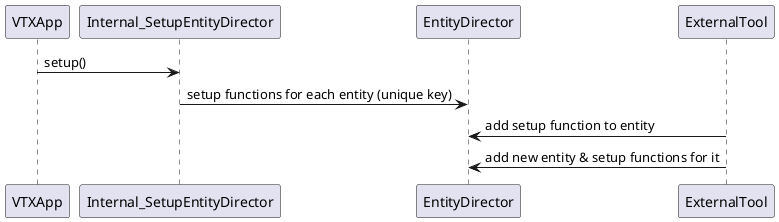

Création d'une entité
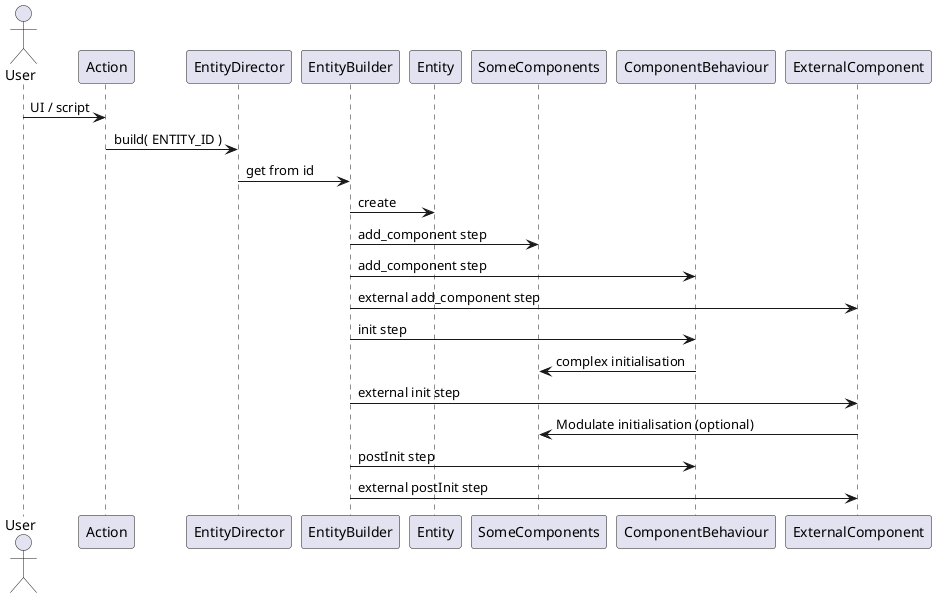

##### Accès à un component

L'accès à un component sur une entité se fait assez facilement via MAIN_REGISTRY().
Il suffit d'appeler la fonction template getComponent avec le type de component désiré et en paramètre une entité, ou un autre composant de l'entité.

Pour récupérer un groupe de composant (par exemple, tous le SceneItemComposant pour faire un parcours de l'ensemble des objets de la scène), il y a la fonction findComposants qui peut prendre de un à plusieurs type et qui retourne une View.
Cette view peut ensuite être parcourue entité par entité pour ensuite itérer sur le composant voulu.
Exemple : accès à l'ensemble des AABBs de la scène pour calculer l'AABB global de la scène.

```cpp
const Core::ECS::View view
    = MAIN_REGISTRY().findComponents<Component::Scene::SceneItemComponent, Component::Scene::AABB>();

_aabb.invalidate();

for ( const Core::ECS::BaseEntity entity : view )
{
    const Component::Scene::AABB & aabbComponent = view.getComponent<Component::Scene::AABB>( entity );
    _aabb.extend( aabbComponent.getWorldAABB() );
}
```

Note : La fonction "hasComponent" permet de vérifier si un component existe bien sur une entité.

##### Signaux

EnTT permet implémente un système de signal pour transmettre les événements de création, de destruction et d'update des components. Cela peut permettre d'updater un component si un autre a été modifié ou de prioriser les destructions.

Exemple pour supprimer le proxy molecule avant la molécule elle-même (et ne pas se retrouver avec des pointeurs invalides à la destruction du proxy)

```cpp
MAIN_REGISTRY().connectSignal<Component::Chemistry::Molecule, &ProxyMolecule::_removeFromRenderer>(
    Core::ECS::SIGNAL::DESTROY, this
);
```

#### ACTION_MANAGER

L'action manager est le système permettant de lancer des actions. Ce système d'action permet de factoriser des comportements lancé depuis plusieurs endroits de l'interface utilisateur.
Il permet aussi de garder une trace des différentes actions lancées pour permettre un undo/redo (TODO) ou encore d'enregistrer et reproduire un comportement complexe (TODO).

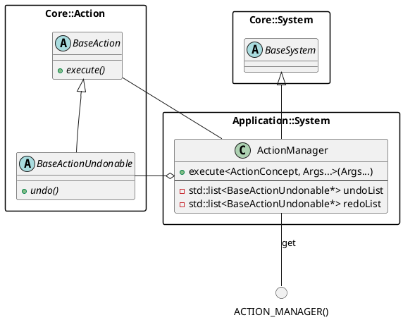

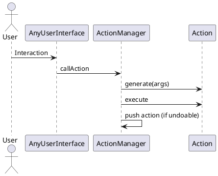

#### UID_SYSTEM

Le système d'uid (Unique IDentifier) est un petit système permettant de distribuer un ou plusieurs (dans un range) identifiant unique pour permettre ensuite l'identification ou la récupération d'un objet à partir de cet identifiant.
Les UID sont actuellement utilisé pour retrouver un atom ou un résidu depuis le renderer avec la fonction de picking.

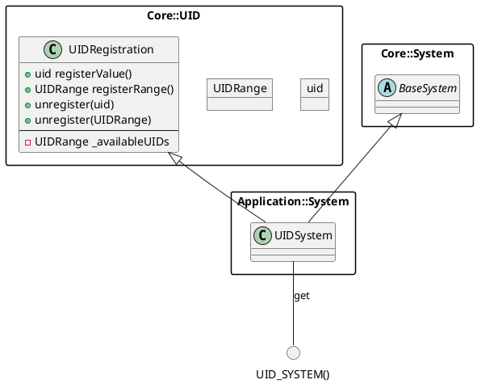

#### SERIALIZATION_SYSTEM

L'outils de serialization permet de serializer au format JSon les objets ayant les fonctions `Util::JSon::BasicJSon & serialize(const T & p_obj)` et `deserialize(const Util::JSon::BasicJSon & p_json, T & p_obj)` correspondantes.

Concrètement, les fonctions de serialization / deserialization ont 3 variantes en fonction de l'objet en paramètre
1) L'objet est un type de base géré par Util::JSon => On génère le JSon correspondant via la lib JSon
2) L'objet possède une fonction serialize/deserialize dans le namespace App::Internal => On appelle la fonction correspondante dans le namespace
3) Pour le reste, on check si une fonction de serialization a été register pour ce type d'objet. Si oui on l'appel, si non on throw une erreur (l'objet n'est pas serializable) 

Les outils externe peuvent déclarer leurs fonctions de sérialization dans le namespace App::Internal (A améliorer) ou enregistrer leur fonction de serialization avec la fonction "registerSerializationFunction" pour pouvoir serializer leurs propres types.

L'outils de sérialisation contient aussi une "upgrade stack" permettant de gérer l'upgrade d'un fichier si la version du fichier est inférieur à la version actuelle gérée par le logiciel.

La fonction UpgradeFunc prends en paramètre le JSon et l'objet à serializer / deserializer en paramètre et va modifier l'un ou l'autre en fonction des modifications apportées à la serialization de l'objet.

En plus de ces fonctions, hérités de la classe Core::Serialization::Serialization, lsystème Serializer implémente deux fonctions supplémentaires `readObject` et `writeObject` permettant de lire et d'écrire un objet directement via un path en utilisant les classes SerializedObject définies dans Core::IO (Reader et Writer).
SerializedObject va automatiquement ajouter le numéro de version de VTX dans le fichier JSon lors du write et appeler les fonctionnalités de la UpgradeList au read.

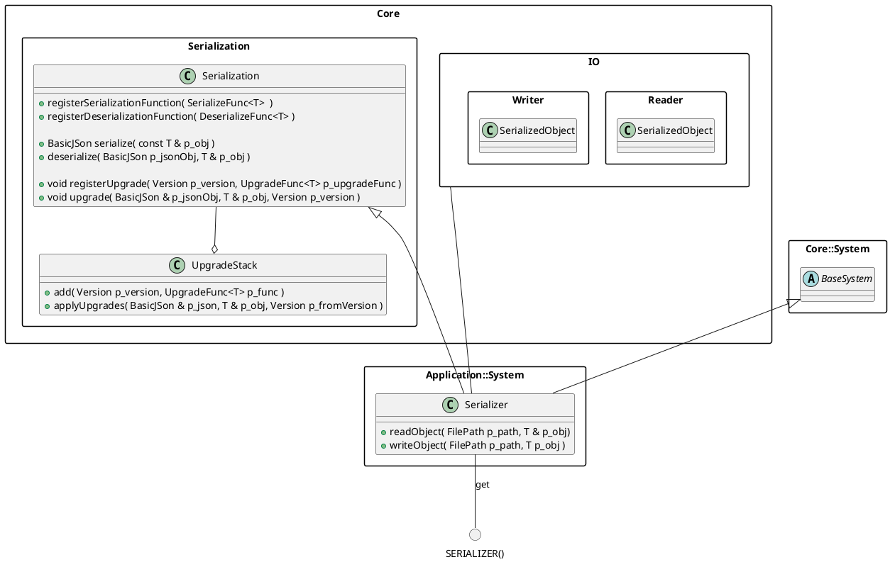

Serialize sequence
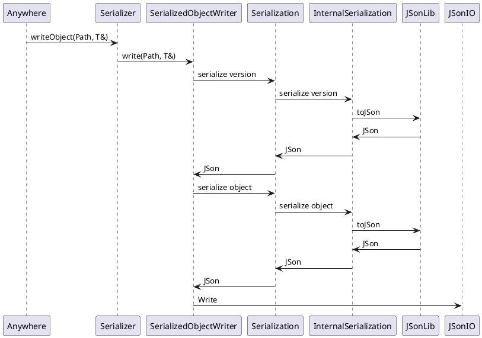

Deserialize sequence
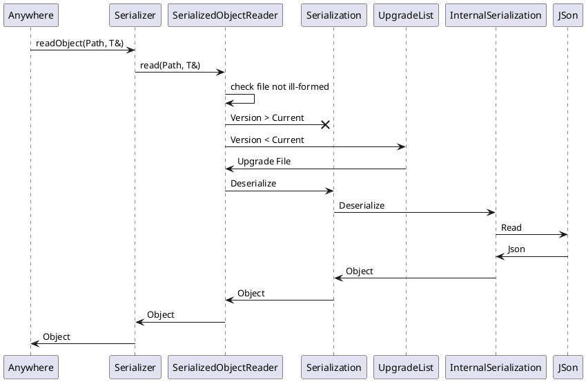

#### SETTINGS

La paramétrisation des différents modules / objets de VTX peut se faire via les settings. Le principe des settings est de pouvoir être facilement accessible depuis n'importe où dans le code, modulaire pour qu'un développeur puisse facilement ajouter les settings  des outils qu'il dévelope et serialisable afin de récupérer les données d'une session à l'autre.

Un setting peut-être de n'importe quel type du moment qu'il implémente les fonctions serialize, deserialize et qu'il contienne une valeur par défaut.

L'ensemble des settings sont stockés dans une map reliant un setting à une clé unique.

Note : le lien direct avec la sérialisation fait que les settings sont directement implémenté dans le namespace Application. Il faudrait peut-être voir à décorreler la sérialization du système de settings en soit pour une archi plus propre.

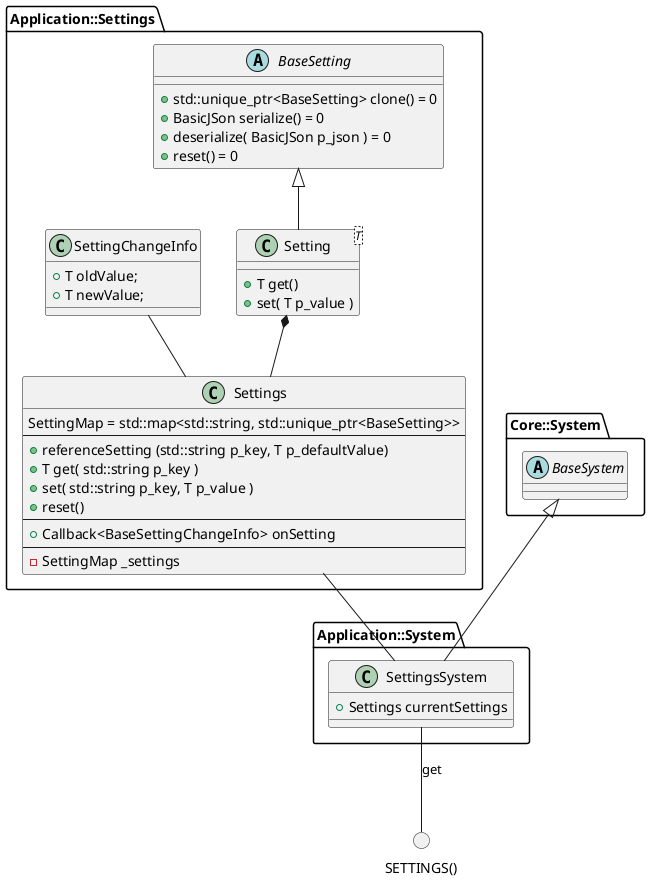

#### SELECTION

La selection est un objet permettant de connaître l'état actuel de la selection, sauver et appliquer des sélections sauvées.
Peuvent être sélectionné des entités équipé d'un composant Selectable. A ce composant est associé un objet héritant de SelectionData permettant une sélection de sous-objets de l'entité.
Ce système un peu plus complexe a été choisi pour éviter d'avoir un comportement de sélection sur chaque atome/résidu/chaine d'une molécule, mais uniquement sur la molécule qui va gérer ses sous-séléctions (par soucis de mémoire et de rapidité de loading).
Ainsi, au lieu d'avoir un bool par atom, on va gérer les sélection avec des ranges d'index.

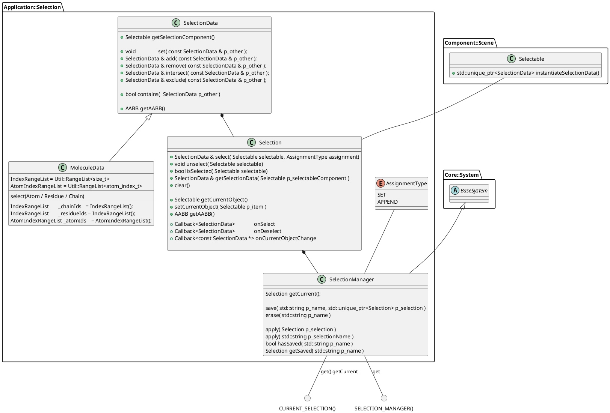

Selection par défaut
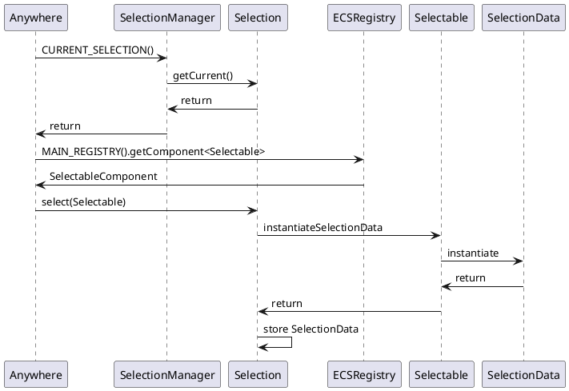

Selection d'un atome
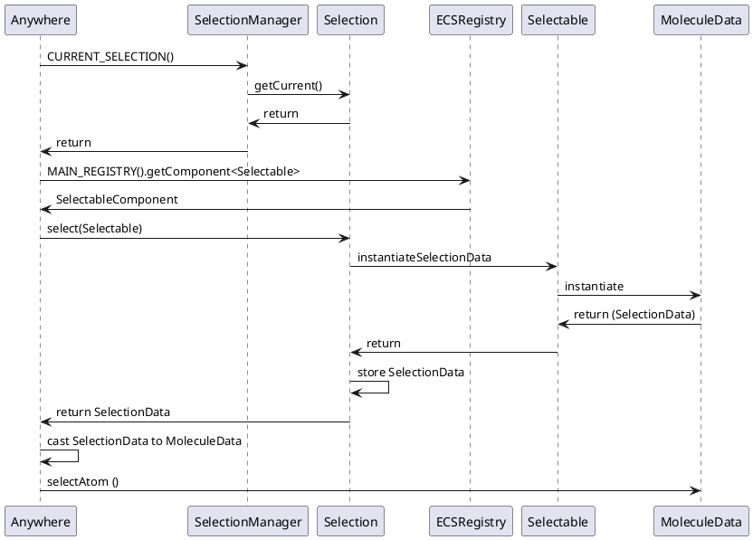

#### THREADING

TO-REDO

#### NETWORKING

TODO


### Components

Les components définisse l

#### Scene::Transform

Gestion du Transform d'une entité. Un transform est défini par défaut, mais il est possible de référencer un autre transform si un autre component possède déjà un transform.

Plusieurs fonctions facilitatrice sont disponible pour manipuler le transform.

Possède la callback onTransform pour signaler une modification dans le transform.

#### Scene::AABB

**Scene::Transform nécessaire pour calculer la world AABB**

Gestion de la BoundingBox d'une entité. Si un transform est affecté à l'entity, le composant peut aussi calculer l'AABB world en plus de l'AABB locale.
L'utilisateur doit définir la fonction de calcul de l'AABB. Lorsqu'une modification a été fait dans le code, il faut appeler la fonction "invalidateAABB" afin de recalculer l'AABB lors de la prochaine demande.

#### Scene::Selectable

Gestion de la sélection de l'objet. L'utilisateur doit définir la fonction qui va générer la SelectionData lors de la sélection. Les callbacks onSelect et onDeselect informent lorsque l'objet est séléctionné ou désélectionné.

#### Scene::UIDComponent

Composant portant les uids liés à l'objet.

#### Scene::Pickable

**Nécessite Scene::Selectable et Scene::UIDComponent**

Gestion de la sélection de l'objet à partir des informations récupérés par l'action de picking. L'utilisateur doit définir la fonction qui va générer la SelectionData à partir des infos de picking.

#### Scene::SceneItemComponent

Composant par défaut sur chaque objet de la scène. Il expose les fonctions minimales pour être manipulé par la scène. C'est à dire un nom et un id persistant pour la sauvegarde.
Ce component permet aussi de généré le composant Updatable et faire des actions à chaque update de la scène (obsolète ?, utiliser VTXApp::onUpdate plutôt ?).

#### ECS::EntityInfoComponent

Composant ajouté par défaut par le RegistryManager sur chacune des entités créé. Il conserve la liste des id uniques persistents des components de l'entité sur laquelle il est attaché.

#### Chemistry::Molecule

Composant stockant les données de la molécule (VTX::Core::Struct::Molecule)

### Cas concret : Molecule

#### Création

Nous allons voir dans le détail ce qu'il se passe depuis le fichier de molécule jusqu'à l'affichage de la molécule dans la fenêtre de rendu.

L'action LoadMolecule est appelée par l'utilisateur via l'interface ou un script.
Cette action va appeler l'ENTITY_DIRECTOR afin de générer une entité molécule avec tous les composants nécessaire à son bon fonctionnement :

- Component::Scene::SceneItem : Composant pour gérer les données de l'objet de scene
- Component::Chemistry::Molecule : Composant contenant les données de la molécule contenu dans Core::Struct::Molecule, des fonctions supplémentaires nécessaire dans l'app (visibilité et suppression des atomes, transform, uids, code pdb) et des fonctions facilitatrices pour accéder aux différentes partie de la molécule (chain, reside, atom)
- Component::Scene::AABB : Gestion de la boite englobante de la molécule
- Component::Scene::Transform : Gestion du transform de la molécule
- Component::Render::ProxyMolecule : Gestion du proxy de la molécule pour le rendu
- Component::Scene::UIDComponent : Gestion des ids uniques de la molécule, de ses atomes et résidus
- Component::Scene::Selectable : Gestion du comportement de séléction
- Component::Scene::Pickable : Gestion du comportement pour le pick dans la scène (requiert Component::Scene::Selectable)
- Component::Behaviour::Molecule : Composant initialisant et articulant tous les autres composants entre eux.

Le path où trouver la molécule est transmis à l'EntityBuilder. Lors de son initialisation, le component Behaviour::Molecule va charger la molécule puis initialiser les différents composants avec les données de la molécule. Notamment le component ProxyMolecule qui va s'occuper de l'interfaçage entre les données de la molécules et le Renderer.

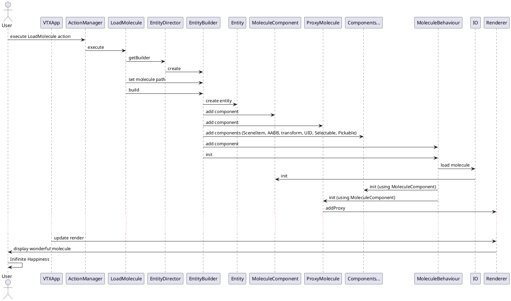

VTXApp est la classe principal du module. Il contient un accès à la scene ainsi que

## UI

### Architecture

L'architecture de l'UI est divisée en 2 parties : Une partie abstraite qui pourrait être commune à l'ensemble des UIs, et une partie dédiée à une UI concrète (dans notre cas Qt).
Ainsi, la plupart des objets Qt héritent d'une classe abstraite dans UI::Core. Dans les faits, c'est relou à maintenir et ça n'a pas été bien maintenu tout le long du developpement. Je pense que la séparation n'est pas forcement la bonne et qu'il faudrait peut-être uniquement séparer le contenu "executif (les actions, la manipulation des données de VTXApp)" du contenu purement UI.

### Initialisation

Actuellement, VTX_UI est pensé pour générer plusieurs UI en fonction d'une directive de pre-proc (VTX_UI_STYLE défini temporairement dans "UI::UIGenerator.hpp"). L'idée est de pouvoir initialiser uniformément l'application peut importe l'UI choisie (CommandLine, Qt, autre).

Le schéma suivant récapitule les étapes d'initialisation
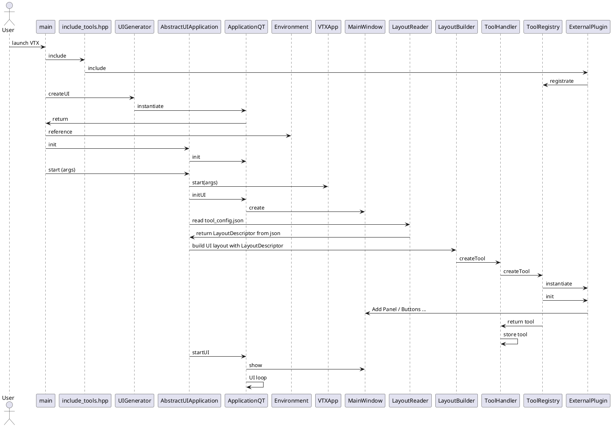

### Mode

Dans l'UI, le mode est une configuration de VTX permettant un set de controllers et d'actions spécifique. Par défaut le mode de VTX est "Visualization" et est adapté à la visualization de molécule 3D. C'est l'unique mode implémenté pour le moment. Dans le futur, on pourrait imaginer un mode spécifique pour faire de l'illustration sur une image rendue, ou un mode spéciale pour l'édition de vidéos.

### Inputs

La réception des inputs utilisateurs (clavier + souris) est laissé à la discrétion de la bibliothèque d'UI utilisé. Un wrapper devra être fait pour envoyer les événements d'inputs à l'InputManager qui va ensuite les traiter et executer les callbacks correspondantes.
Les controllers ou n'importe quel autre objet peut ajouter sa propre callback pour réagir aux événements envoyés par l'InputManager. 

De base dans Qt, chaque widget peut récupérer les événements d'inputs qui ne seront reçu que si le widget en question a le focus. Pour coller avec le système VTX, les inputs vont être capté depuis la MainWindow (qui a toujours le focus tant que l'appli à le focus) puis être transmis à l'InputManager.
Les widgets qui veulent récupérer l'input devront tester au besoin si ils ont bien le focus avant d'executer l'action correspondante.
Passer par un système centralisé permet de mieux gérer l'état du clavier lorsque l'application perd le focus par exemple.

Schéma d'un input executé via l'interface Qt
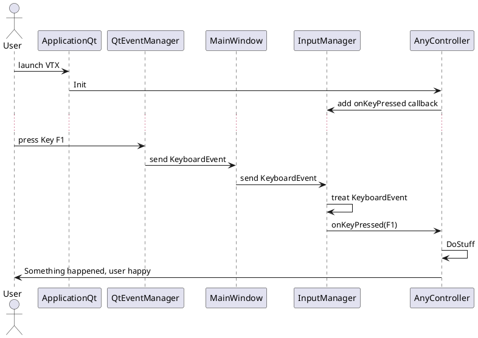

### Controllers

Les controllers sont des objets qui récupèrent les inputs de l'utilisateur afin d'effectuer des actions concrètes dans le logiciel. Dans VTX, on considère 3 types de controllers : Les CameraControllers qui permettent le contrôle de la camera, les PickerControllers qui gèrent le picking dans la scène et les ShortcutsControllers qui lient des actions à des séquences de touche (touche unique ou touche + modifier).

Selon le type de controller que l'on souhaite créer, il faut créer une classe héritant de Controller::BaseCameraController, Controller::BasePickerController ou Controller::BaseShortcutController. Si on souhaite créer un autre type de controller particulier, on peut hériter directement de BaseController.

Actuellement dans VTX, deux CameraController sont disponible (Trackball et Freefly), un PickerController (SelectionPicker) et trois ShortcutControllers (GlobalShortcut, VisualizationShortcut et DebugShortcut).

Diagramme de classe des Controllers
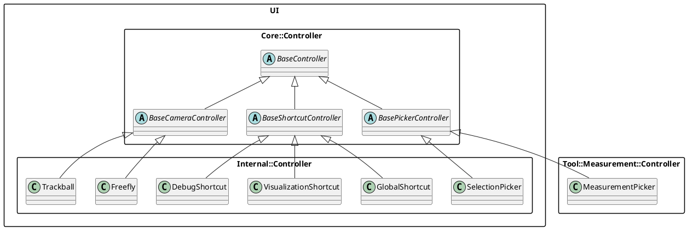
### Animation (move to App ?)

Le module UI pourvoit un système d'animation. Le principe est de pouvoir lancer une succession d'animations sur un ou plusieurs objets afin de créer un petit film ou bien de modifier les données de certains objets sur une durée longue.

Pour cela, le système est composé d'une fonction BaseAnimation qui fourni le set minimale de fonction pour s'interfacer avec l'AnimationSystem afin de pouvoir jouer ou arrêter une animation.

Un set d'animation est disponible par défaut dans le dossier Internal/Animation. Il contient actuellement une animation de Translation ainsi que l'animation pour effectuer l'Orient et le Reset de la camera. La rotation des molécules pourrait aussi être ajoutée ici, mais il faudrait peut-être rajouter une fonctionnalité à l'AnimationSystème pour qu'il puisse plusieurs séquence d'animation en parallèle.

### Tools

