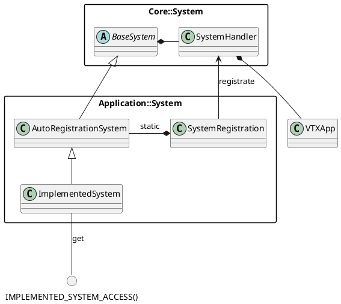
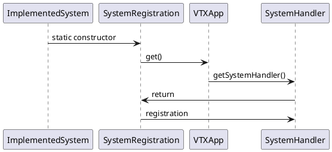
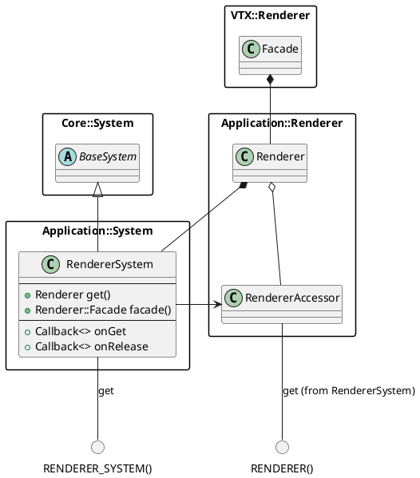
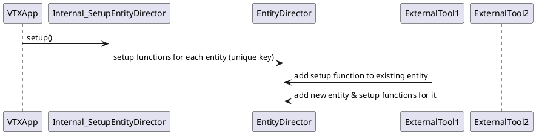
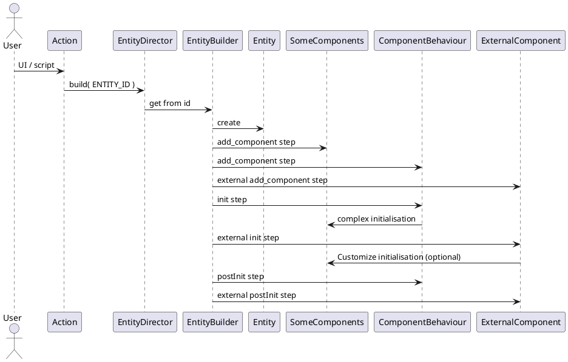
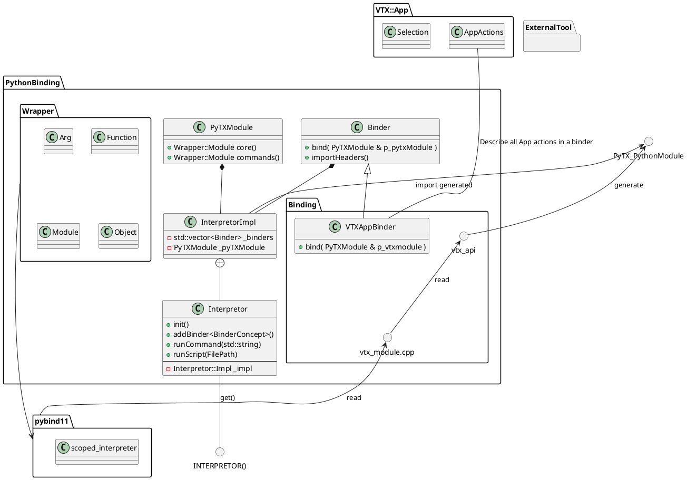
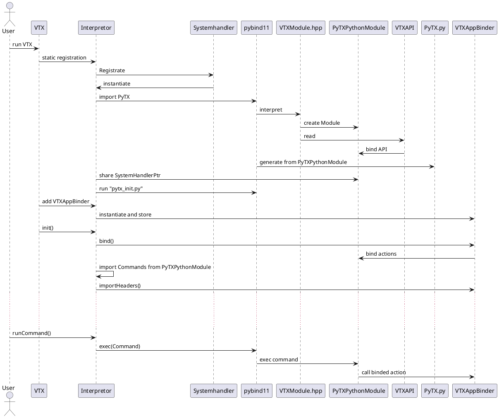
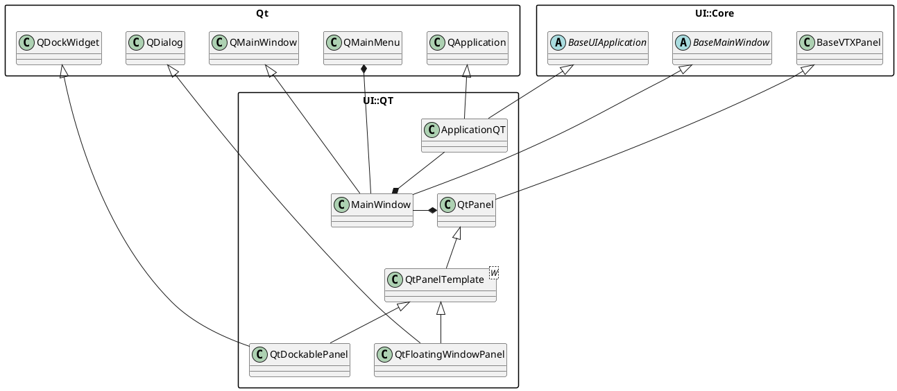

Pour une bonne lecture de cette doc sur VSCode, installez l'extension plantUML (jebbs.plantuml) puis affichez la preview (Ctrl + Shift + V)

# VTX

# VTX_UTIL

# VTX_CORE

# VTX_IO

# VTX_RENDER

# VTX_APP

## Présentation

Le module App s'occupe de gérer les articulations entre les structures de Core et le renderer, ainsi que de gérer plusieurs systèmes structurant le logiciel VTX.

### Hierarchie de fichier

le code source de App est divisé en plusieurs dossiers :

- "core" contient les structures abstraites et minimales des différents systèmes utilisés dans le module. Les fonctionnalités implémentées dans Core ne doivent pas nécessiter de code en dehors de leur propre dossier (ou d'un autre dossier de Core si c'est le sens de la feature).

- "application" va contenir l'ensemble des systèmes liés à l'application VTX, implémentant pour la plupart les structures contenues dans core.

- "component" contient l'ensemble des components utilisés par l'ECS, réparties selon leur champ d'action (chemistry pour les components lié à la chimie, scene pour les composants de scene, etc..)

- "entity" contient les fonctions permettant de générer les entités complexes possédant plusieurs composants intéragissant entre-eux.

- "internal" contient des paramétrisations ou des procédures utilisants les systèmes de "application" spécifique à VTX (i.e la liste des settings de VTX, les fonctions de serialisation, etc)

- "helper" contient des fonctions utilitaires pour factoriser des fonctionnalités un peu plus poussées.

- "action" contient les différentes actions pouvant être lancées sur VTX. Les actions sont les fonctionnalités que peux executer l'utilisateur dans le logiciel. Ce sont les points d'entrées pour les interactions avec le module VTX_APP.

Outre ces dossiers, app contient deux fichiers à sa racine : vtx_app, qui est le point d'entrée et le singleton qui gère la durée de vie du module, et info qui contient uniquement des données statiques informant sur la version de VTX.

## Architecture

Globalement le module VTX_APP est composé de systèmes plus ou moins indépendants centralisés dans un SystemHandler afin que l'environnement VTX puisse facilement être partagé dans l'environnement Python. Le singleton VTXApp s'occupe de stocker le SystemHandler et de gérer l'initialisation, la boucle logique et la destruction du module.
Parmi les systèmes, on peut notamment recenser la scène, l'entity component system, le serializer, l'action manager...

### Structure d'un système

Chaque système hérite de BaseSystem et possède un membre static "SystemRegistration" lui permettant de s'enregistrer automatiquement et directement auprès du SystemHandler. Chaque système possède une ou plusieurs fonctions facilitatrices pour accéder aisément depuis n'importe quel namespace aux features désirées.

Diagramme de classe d'un système


Diagramme de séquence d'initialisation d'un système


Diagramme de séquence de l'accès dans le code à un système


### Rendu de molecule

La fonctionnalité principale de VTX est de faire du rendu de molécule. Ceci va être fait via l'utilisation de 3 systèmes principaux : Le renderer, la scène et l'entity component system (ECS).

Synthétiquement la scène est l'objet qui va référencer les différents objets de scène instanciés. Ces objets sont créés en utilisant l'ECS. Ce sont donc des entités possédant un ou plusieurs component permettant de définir son comportement. L'un de ces components va servir d'interfaçage avec le Renderer qui lui va s'occuper de communiquer avec le module VTX_RENDERER pour permettre l'affichage de ces objets.

### Liste des systèmes

#### RENDERER()

Le rendu à proprement parlé n'est pas géré par VTX_APP, mais le module communique avec la classe Renderer::Facade du module VTX_RENDERER pour généré et paramétrer le context openGL.
Cette tâche est opérée par le système Renderer.

Renderer instantie la facade VTX::Renderer::Facade qui sera utilisée par le rendu. Un petit système est mis en place pour appeler des callbacks avant d'accéder et release l'accès au renderer pour gérer l'activation du context openGL.

RENDERER() permet un accès simplifié à la facade en intégrant l'appel des callbacks d'accès.
RENDERER_SYSTEM() permet d'accéder directement au système et potentiellement au renderer sans passé par les callbacks.



#### SCENE()

Dans VTX, la scène est en fait un component ne contenant qu'un ensemble de fonctions facilitatrice pour pouvoir accéder aux objets de scène (Entity possédant un component "SceneItemComponent"). Sa fonction d'update va permettre la mise à jour de l'état des différents SceneItemComponent.

#### ECS

l'Entity Component System (ECS) est un système permettant de stocker, de lier des components à des entity et de construire des système complexes (et modulaire) par composition.

Nous utilisons la lib EnTT pour gérer ça.
EnTT implémente l'ECS en 3 parties
- Les entités (entt::entity) : C'est une simple id unique servant d'identifiant
- Les composants : dans entt, cela peut-être n'importe quel class / struct avec de la donnée (une struct vide cause une assert). Ce sont eux qui vont contenir les données et les comportements affectés aux entités.
- Le registre (entt::registry) : C'est la structure de donnée qui va stocker les différents components par type et qui va rattacher chacun de ces components à une entité.

Dans VTX, nous suivons cet implémentation avec Core::ECS::BaseEntity pour les entités (id unique), Core::ECS::BaseComponent pour les composants (pour permettre des comportements globaux sur l'ensemble des composants au besoin) et Core::ECS::Registry, le registre qui contient l'ensemble des components de l'application.

La création d'entité, l'ajout, la recherche et la destruction de component passe par le registre.
La fonction MAIN_REGISTRY dans Application::System::ECSSystem permet d'accéder directement au registre.

Les différents objets de VTX sont donc une composition de plusieurs Component interdépendants assurant le bon comportement de l'objet. Avec les modules UI et Tool, on a parfois besoin de modifier la génération d'un objet (par exemple, ajouter par défaut un component sur une molécule). Pour gérer ces cas-là, nous avons un système appelé EntityDirector qui va permettre de créé l'entité avec ses composants par défaut et l'initialiser de manière modulaire.

Ce système est accessible via la fonction ENTITY_DIRECTOR(). Il permet de modifier le processus de création d'une entité, ainsi que de créer les entités, avec tous leurs composants initialisés.

Doc EnTT : https://github.com/skypjack/entt/wiki/Crash-Course:-core-functionalities

##### Créer / Détruire des entités ou des components

La création et la destruction des entités et des components se fait par le registre accessible via la fonction facilitatrice MAIN_REGISTRY() de l'ECS_SYSTEM.

La création d'une entité se fait simplement en appelant la fonction createEntity du registre.
```cpp
Core::ECS::BaseEntity newEntity = MAIN_REGISTRY().createEntity();
```

Une fois l'entité créée, il est possible de lui accrocher des composants en appelant la fonction addComponent<ComponentType> du registre, en fournissant une entité en paramètre.
il est aussi possible de fournir directement un composant en paramètre. A ce moment là, le composant sera ajouter sur l'entité liée au composant passé en paramètre.
```cpp
Component1 & component1 = MAIN_REGISTRY().addComponent<Component1>(newEntity);
Component2 & component2 = MAIN_REGISTRY().addComponent<Component2>(newEntity);
Component3 & component3 = MAIN_REGISTRY().addComponent<Component3>(component2);
```

Pour supprimer un composant, nous avons la fonction removeComponent qui prend le type du composant à détruire et l'entité sur laquelle est le composant en paramètre.

```cpp
MAIN_REGISTRY().removeComponent<Component3>(newEntity);
```

Enfin, il est possible de détruire une entité et l'ensemble de ses composants via la fonction destroyEntity du registre.
```cpp
MAIN_REGISTRY().destroyEntity(newEntity);
```

##### Génération d'une entité complexe

Les objets que nous manipulons dans VTX peuvent posséder un certains nombre de components. Pour faciliter leur création et les rendre modulaire, nous avons un sous-système dédié dans ECS_SYSTEM appelé l'EntityDirector.

la génération d'une entité se fait en 3 étapes sur lesquelles des tool externes peuvent ajouter leur propre séquence d'initialisation :
1) AddComponent : Ajout de l'ensemble des composants 
2) Setup : Initialisation des composants (indépendant ou entre eux).
3) PostSetup : Actions qui ne peuvent être faites qu'une fois l'ensemble des composants initialisés

Pour les entités complexes, on peut ajouter un composant dédié qui peut s'occuper de l'initialisation de tous les composants (Appelé "XxxBehaviour" dans VTX (i.e. MoleculeBehaviour)).

Dans VTX_App, une fonction présente dans Internal::ECS::SetupEntityDirector permet l'initialisation de l'ensemble des entités de App. Ensuite des tools externes peuvent ajouter des fonctions dans les différentes étapes de construction pour rajouter des components par défaut aux entités.

Initialisation de l'EntityDirector


Création d'une entité


##### Accès à une entity ou un component

Comme leur création et leur destruction, l'accès aux entités et aux components se fait par le registre (accessible via la fonction facilitatrice MAIN_REGISTRY() de l'ECS_SYSTEM).

Pour récupérer une entité depuis un component, on peut appeler la fonction getEntity qui prends en paramètre un composants. La fonction retournera l'entité sur laquelle est accroché le component.
```cpp
const Core::ECS::BaseEntity entity = MAIN_REGISTRY().getEntity( _moleculeComponent );
```

L'accès à un component sur une entité se fait grâce à la fonction template getComponent avec le type de component désiré et en paramètre une entité, ou un autre composant de l'entité.
```cpp
const Component1 & component1 = MAIN_REGISTRY().getComponent<Component1>( entity );
```

Il est possible de tester si une entité possède un certain type de composant en appelant la fonction hasComponentsur cette entité.
```cpp
if ( MAIN_REGISTRY().hasComponent<Component1>( entity ) )
{
    // Do something
}
```

La fonction findComponents permet de récupérer tous les composants d'un même type sur l'ensemble des entités (par exemple, tous le SceneItemComposant pour faire un parcours de l'ensemble des objets de la scène). findComponents peut prendre un à plusieurs type et retourne une View.
Cette view peut ensuite être parcourue entité par entité pour ensuite itérer sur le composant voulu.

Exemple : accès à l'ensemble des AABBs de la scène pour calculer l'AABB global de la scène.
```cpp
const Core::ECS::View view
    = MAIN_REGISTRY().findComponents<Component::Scene::SceneItemComponent, Component::Scene::AABB>();

_aabb.invalidate();

for ( const Core::ECS::BaseEntity entity : view )
{
    const Component::Scene::AABB & aabbComponent = view.getComponent<Component::Scene::AABB>( entity );
    _aabb.extend( aabbComponent.getWorldAABB() );
}
```

##### Signaux

EnTT implémente un système de signal transmettant les événements de création, de destruction et d'update des components. Cela peut notamment permettre d'updater un component si un autre a été modifié ou de prioriser les destructions.

Exemple : Suppression du proxy molecule avant la molécule elle-même (et ne pas se retrouver avec des pointeurs invalides à la destruction du proxy)
```cpp
MAIN_REGISTRY().connectSignal<Component::Chemistry::Molecule, &ProxyMolecule::_removeFromRenderer>(
    Core::ECS::SIGNAL::DESTROY, this
);
```

#### ACTION_MANAGER

L'action manager est le système permettant de lancer des actions. Ce système d'action permet de factoriser des comportements lancés depuis plusieurs endroits de l'interface utilisateur.
Il permet aussi de garder une trace des différentes actions lancées pour permettre un undo/redo (TODO) ou encore d'enregistrer et reproduire un comportement complexe (TODO).


#### UID_SYSTEM

Le système d'uid (Unique IDentifier) est un petit système permettant de distribuer un ou plusieurs (dans un range) identifiant unique pour permettre ensuite l'identification ou la récupération d'un objet à partir de cet identifiant.
Les UID sont actuellement utilisé pour retrouver un atome ou un résidu depuis le renderer avec la fonction de picking.


#### SERIALIZATION_SYSTEM

L'outils de serialization permet de serializer au format JSon les objets ayant les fonctions `Util::JSon::BasicJSon & serialize(const T & p_obj)` et `deserialize(const Util::JSon::BasicJSon & p_json, T & p_obj)` correspondantes.

Concrètement, les fonctions de serialization / deserialization ont 3 variantes en fonction de l'objet en paramètre
1) L'objet est un type de base géré par Util::JSon => On génère le JSon correspondant via la lib JSon
2) L'objet possède une fonction serialize/deserialize dans le namespace App::Internal => On appelle la fonction correspondante dans le namespace
3) Pour le reste, on check si une fonction de serialization a été register pour ce type d'objet. Si oui on l'appel, si non on throw une erreur (l'objet n'est pas serializable) 

Les outils externe peuvent déclarer leurs fonctions de sérialization dans le namespace App::Internal (A améliorer) ou enregistrer leur fonction de serialization avec la fonction "registerSerializationFunction" pour pouvoir serializer leurs propres types.

L'outils de sérialisation contient aussi une "upgrade stack" permettant de gérer l'upgrade d'un fichier si la version du fichier est inférieur à la version actuelle gérée par le logiciel.

La fonction UpgradeFunc prends en paramètre le JSon et l'objet à serializer / deserializer en paramètre et va modifier l'un ou l'autre en fonction des modifications apportées à la serialization de l'objet.

En plus de ces fonctions, hérités de la classe Core::Serialization::Serialization, lsystème Serializer implémente deux fonctions supplémentaires `readObject` et `writeObject` permettant de lire et d'écrire un objet directement via un path en utilisant les classes SerializedObject définies dans Core::IO (Reader et Writer).
SerializedObject va automatiquement ajouter le numéro de version de VTX dans le fichier JSon lors du write et appeler les fonctionnalités de la UpgradeList au read.


Serialize sequence


Deserialize sequence


#### SETTINGS

La paramétrisation des différents modules / objets de VTX peut se faire via les settings. Le principe des settings est de pouvoir être facilement accessible depuis n'importe où dans le code, modulaire pour qu'un développeur puisse facilement ajouter les settings des outils qu'il dévelope et serialisable afin de récupérer les données d'une session à l'autre.

Un setting peut-être de n'importe quel type du moment qu'il implémente les fonctions serialize, deserialize et qu'il contienne une valeur par défaut.

L'ensemble des settings sont stockés dans une map reliant un setting à une clé unique.

Note : le lien direct avec la sérialisation fait que les settings sont directement implémentés dans le namespace Application. Il faudrait peut-être voir à décorreler la sérialization du système de settings pour une archi plus propre.


#### SELECTION

La selection est un objet permettant de connaître l'état actuel de la selection, sauver et appliquer des sélections sauvées.
Peuvent être sélectionné des entités équipés d'un composant Selectable. A ce composant est associé un objet héritant de SelectionData permettant de gérer une sous-sélection de l'objet.
Ce système un peu plus complexe a été choisi pour éviter d'avoir un comportement de sélection sur chaque atome/résidu/chaine d'une molécule, mais uniquement sur la molécule qui va gérer ses sous-séléctions (par soucis de mémoire et de rapidité de loading).
Ainsi, au lieu d'avoir un bool par atome, on va gérer les sélections avec des ranges d'index.


Selection par défaut


Selection d'un atome


#### THREADING

TO-REDO

#### NETWORKING

TODO


### Components

Chaque component défini une brique de comportement qui une fois lié aux autres components définira le comportement général de l'entité. EnTT, la bibliothèque d'ECS que nous utilisons ne permet pas de récupérer les types enfants d'un type défini. Ainsi certains component propose une interface générale de fonctionnement avec des pointeurs de fonctions qu'il faudra définir lors de la génération de l'entité.
Tous les components (à l'exception de la scène ???) sont définis dans le dossier component du module VTX_APP. Ils sont classés selon leurs fonctionnalités.

#### Scene::Transform

Gestion du Transform d'une entité. Un transform est défini par défaut, mais il est possible de référencer un autre transform si un autre component possède déjà un transform.
Ce component contient aussi plusieurs fonctions de manipulation sur le transform, ainsi qu'une callback onTransform signalant une modification dans le transform. (Rajouter un mask pour définir les composantes du transform modifiée ?)

#### Scene::AABB

**Scene::Transform nécessaire pour calculer la world AABB**

Gestion de l'Axis Aligned Bounding Box d'une entité. Si un component Scene::Transform est attaché à l'entité, le composant pourra aussi calculer l'AABB world en plus de l'AABB locale.
L'utilisateur doit initialiser la fonction de calcul de l'AABB. Lorsqu'une modification imlique de recalculer la AABB, il faut appeler la fonction "invalidateAABB". Ainsi, lors de la prochaine demande d'AABB, elle sera recalculée.

#### Scene::Selectable

Gestion de la sélection de l'objet. L'utilisateur doit définir la fonction qui va générer la SelectionData lors de la sélection. Les callbacks onSelect et onDeselect informent lorsque l'objet est séléctionné ou désélectionné.

#### Scene::UIDComponent

Composant portant les uids liés à l'objet.

#### Scene::Pickable

**Nécessite Scene::Selectable et Scene::UIDComponent**

Gestion de la sélection de l'objet à partir des informations d'uid récupérés par l'action de picking. L'utilisateur doit définir la fonction qui va générer la SelectionData à partir des infos de picking.

#### Scene::SceneItemComponent

Composant par défaut sur chaque objet de la scène. Il expose les fonctions minimales pour être manipulé par la scène. C'est à dire un nom et un id persistant pour la sauvegarde.
Ce component permet aussi de générer le composant Updatable et faire des actions à chaque update de la scène (obsolète ?, utiliser VTXApp::onUpdate plutôt ?).

#### Scene::Enable

**A relinker**

Component gérant l'état actif ou inactif d'une entité.

#### ECS::EntityInfoComponent

Composant ajouté par défaut par le RegistryManager sur chacune des entités créé. Il conserve la liste des id uniques persistents des components de l'entité sur laquelle il est attaché. (Nécessaire pour la sérialisation.)

#### Chemistry::Molecule

Composant stockant les données de la molécule (VTX::Core::Struct::Molecule)

#### Behaviour::Molecule

Ce composant permet d'initialiser l'ensemble des composants de la molécule dans le bon ordre et de gérer les intéractions entre les composants via les callbacks qu'ils exposent.

#### IO::MoleculeMetadata

Component ajouté lors du loading de la molécule qui va contenir le path de la molécule, son code pdb ainsi que les meta-données des fichiers de configuration.
Ce component doit être attaché à une entité possédant un component "Chemistry::Molecule".

#### IO::SceneFileInfo

**A relinker**

Ce composant contient les informations de sauvegarde de la scène (path, modification).
Il doit être attaché à une entité possédant un component "Scene".

#### Render::Camera

**Nécessite Scene::Transform**

Component portant les données de la camera (near clip & far clip, FOV, screen size, aspect ratio, projection, target, view & projection matrix).
Ce component expose plusieurs callback pour réagir à la modification de certaines de ces données (onMatrixViewChange, onMatrixProjectionChange, onClipInfosChange et onProjectionChange).

#### Render::Proxy...

Les component ProxyMolecule, ProxyCamera, etc sont les components comportant les données relatives aux proxies définis dans VTX_RENDERER permettant la liaison entre les données de App et le Renderer.
L'accès aux proxy de renerer se fait via un Wrapper implicitant l'appel des callbacks makeCurrent et donCurrent du Renderer.

#### Render::Viewpoint

**A relinker**

Component portant les données spécifiques aux viewpoints. (Le transform doit être géré par le component dédié. Il doit y avoir ici la target à set à la camera).

#### Representation::ColorLayout

**WIP**

Component portant les données spécifiques aux Layout de couleurs. Il est possible de mettre à jour une ou toutes les couleurs.
Une callback est invoquée lorsqu'il y a un changement sur les couleurs du layout.

### Cas concret d'une entité complexe : la Molecule

#### Création

Nous allons voir dans le détail ce qu'il se passe depuis le fichier de molécule jusqu'à l'affichage de la molécule dans la fenêtre de rendu.

L'action LoadMolecule est appelée par l'utilisateur via l'interface ou un script.
Cette action va appeler l'ENTITY_DIRECTOR afin de générer une entité molécule avec tous les composants nécessaire à son bon fonctionnement :

- Component::Scene::SceneItem : Composant pour gérer les données de l'objet de scene
- Component::Chemistry::Molecule : Composant contenant les données de la molécule contenu dans Core::Struct::Molecule, des fonctions supplémentaires nécessaire dans l'app (visibilité et suppression des atomes, transform, uids, code pdb) et des fonctions facilitatrices pour accéder aux différentes partie de la molécule (chain, reside, atom)
- Component::Scene::AABB : Gestion de la boite englobante de la molécule
- Component::Scene::Transform : Gestion du transform de la molécule
- Component::Render::ProxyMolecule : Gestion du proxy de la molécule pour le rendu
- Component::Scene::UIDComponent : Gestion des ids uniques de la molécule, de ses atomes et résidus
- Component::Scene::Selectable : Gestion du comportement de séléction
- Component::Scene::Pickable : Gestion du comportement pour le pick dans la scène (requiert Component::Scene::Selectable)
- Component::Behaviour::Molecule : Composant initialisant et articulant tous les autres composants entre eux.

Le path où trouver la molécule est transmis à l'EntityBuilder. Lors de son initialisation, le component Behaviour::Molecule va charger la molécule puis initialiser les différents composants avec les données de la molécule. Notamment le component ProxyMolecule qui va s'occuper de l'interfaçage entre les données de la molécules et le Renderer.


## PYTHON_BINDING

Ce module fourni à l'utilisateur la possibilité d'executer ses propres scripts python, ainsi que d'executer les actions prédéfinis dans VTX via un prompt dans l'interface.
Le système est pensé pour qu'il puisse être étendu depuis les tools.

Le rôle de PYTHON_BINDING est de gérer la connection CPP - Python, de fournir des outils pour executer des script externe et facilement lier des actions à des commandes python executable depuis l'interpreteur. PYTHON_BINDING devrait fournir aussi l'implémentation de l'API VTX pour le scripting en python. 

Pour gérer cela, nous avons décidé d'utiliser la bibliothèque pybind11 pour générer l'API python de VTX, ainsi que l'interpreteur que la bibliothèque embarque pour executer les commandes python.

Concrètement, on va créer un module python en utilisant la macro PYBIND11_MODULE de pybind11.

Doc Pybind11 : https://pybind11.readthedocs.io/en/stable/

Ce module (appelé PyTX) est divisé en 3 sous-modules : Core, API et Commands.
- Core va contenir les classes et fonctions minimales d'utilisation ( Classe de redirection des logs, le partage du SystemHandler, et les fonctions d'ajout de commandes et de modules ).
- API va contenir les classes et les membres des classes de VTX que l'on veut exposer pour l'écriture de scripts.
- Commands va contenir l'ensemble des fonctions qui pourront être appelée depuis l'interpreteur python.

Dans la macro PYBIND11_MODULE on défini la hiérarchie des modules, on implémente les fonctions minimales d'utilisation dans Core et on implémente l'API pour VTXApp dans le sous-module API. Les commandes et le reste de l'API sera ensuite chargé et peuplé par VTX et les différents outils branchés à VTX.

Le système Interpretor (accessible via la fonction INTERPRETOR()) est l'élément central de ce module. Il va s'occuper d'initialiser le module Python, centraliser les différents Binders implémenté pour lier les fonctionnalités de VTX au Python, instancier l'interpreteur Python et executer les scripts avec pybind11.

Diagramme de classe


Diagramme de séquence


### Binding et API

La déclaration des fonctionnalités de VTXApp à pybind11 pour la génération de l'API Python se fait dans le fichier vtx_module.cpp . Celui-ci contient la macro PYBIND11_MODULE où les sous-modules seront déclaré, puis un appel à la fonction apiModule de vtx_api va peupler le sous-module API avec les fonctionnalités liées à VTXApp.
Pour éviter un fichier kilométrique, chaque fonctionnalité de VTXApp pourra être splittée dans un fichier qui pourra être placé dans le dossier "binders".
L'implémentation de fonctionnalité un peu plus complexe pourra être développé dans le dossier "api" puis pourra être intégré au module depuis le fichier correspondant dans le dossier "binding/binders"

le dossier contient aussi la classe VTXAppBinder, qui va linker les actions de App à une commande dans le sous-module Command (qui pourra ensuite être appelé depuis l'interpreteur.).

### API de sélection

Afin d'avoir un objet de sélection qui puisse être généré et utilisable dans les commandes, nous avons mis en place une classe SelectionInterpretor modulaire qui va généré un objet de sélection à partir d'une chaîne de caractères. 

MoleculeInterpretor est une classe qui va être attachée à SelectionInterpretor et qui va générer un objet App::Selection::MoleculeData correspondant aux paramètres passé à la fonction "select".

L'ajout d'une classe SelectionWrapper pour l'API va nous permettre d'implémenter un ensemble de fonctionnalité pour manipuler plus facilement les sélections depuis l'API Python.

### Wrapper

Les différents types issus de pybind11 et nécessitant d'être lu depuis des modules externes sont wrapper dans les différentes classes définies dans le dossier Wrapper.

### Logging

La classe LogRedirection contient les fonctions write et flush nécessaires à la redirection des logs issus de l'interpreteur Python. Le binding de cette classe est décrit dans vtx_module.cpp et les fonctionnalités sont linkée dans la fonction "initializePythonModule()" de la classe Interpretor::Impl .

### Actions

Le module VTX_PYTHON_BINDING possède une action : "RunScript" qui permet de lancer le script au chemin fourni.

## UI

### Architecture

L'architecture de l'UI est divisée en 2 parties : Une partie abstraite qui pourrait être commune à l'ensemble des UIs, et une partie dédiée à une UI concrète (dans notre cas Qt).
Ainsi, la plupart des objets Qt héritent d'une classe abstraite dans UI::Core. Dans les faits, c'est relou à maintenir et ça n'a pas été bien maintenu tout le long du developpement. Je pense que la séparation n'est pas forcement la bonne et qu'il faudrait peut-être uniquement séparer le contenu "executif (les actions, la manipulation des données de VTXApp)" du contenu purement UI.

Doc de Qt : https://doc.qt.io/qt-6/qwidget.html

Architecture de l'UI QT


### Initialisation

Actuellement, VTX_UI est pensé pour générer plusieurs UI en fonction d'une directive de pre-processeur (VTX_UI_STYLE défini temporairement dans "UI::UIGenerator.hpp"). L'idée est de pouvoir initialiser uniformément l'application peut importe l'UI choisie (CommandLine, Qt, autre).

Le schéma suivant récapitule les étapes d'initialisation
```plantuml
@startuml

actor User
participant main
participant include_tools.hpp
participant UIGenerator
participant BaseUIApplication
participant ApplicationQT
participant Environment
participant VTXApp
participant MainWindow
participant LayoutReader
participant LayoutBuilder
participant ToolHandler
participant ToolRegistry
participant ExternalPlugin

User -> main : launch VTX
main -> include_tools.hpp : include 
include_tools.hpp -> ExternalPlugin : include
ExternalPlugin -> ToolRegistry : registrate
main -> UIGenerator : createUI
UIGenerator -> ApplicationQT : instantiate
ApplicationQT -> main : return
main -> Environment : reference
main -> BaseUIApplication : init
BaseUIApplication -> ApplicationQT : init
main -> BaseUIApplication : start (args)
BaseUIApplication -> VTXApp : start(args)
BaseUIApplication -> ApplicationQT : initUI
ApplicationQT -> MainWindow : create
BaseUIApplication -> LayoutReader : read tool_config.json
LayoutReader -> BaseUIApplication : return LayoutDescriptor from json
BaseUIApplication -> LayoutBuilder : build UI layout with LayoutDescriptor
LayoutBuilder -> ToolHandler : createTool
ToolHandler -> ToolRegistry : createTool
ToolRegistry -> ExternalPlugin : instantiate
ToolRegistry -> ExternalPlugin : init
ExternalPlugin -> MainWindow : Add Panel / Buttons ...
ToolRegistry -> ToolHandler : return tool
ToolHandler -> ToolHandler : store tool
BaseUIApplication -> ApplicationQT : startUI
ApplicationQT -> MainWindow : show
ApplicationQT -> ApplicationQT : UI loop

@enduml
```

### Mode

Dans l'UI, le mode est une configuration de VTX permettant un set de controllers et d'actions spécifique. Par défaut le mode de VTX est "Visualization" et est adapté à la visualization de molécule 3D. C'est l'unique mode implémenté pour le moment. Dans le futur, on pourrait imaginer un mode spécifique pour faire de l'illustration sur une image rendue, ou un mode spéciale pour l'édition de vidéos.

### Inputs

La réception des inputs utilisateurs (clavier + souris) est laissé à la discrétion de la bibliothèque d'UI utilisé. Un wrapper devra être fait pour envoyer les événements d'inputs à l'InputManager qui va ensuite les traiter et executer les callbacks correspondantes.
Les controllers ou n'importe quel autre objet peut ajouter sa propre callback pour réagir aux événements envoyés par l'InputManager. 

De base dans Qt, chaque widget peut récupérer les événements d'inputs qui ne seront reçu que si le widget en question a le focus. Pour coller avec le système VTX, les inputs vont être capté depuis la MainWindow (qui a toujours le focus tant que l'appli à le focus) puis être transmis à l'InputManager.
Les widgets qui veulent récupérer l'input devront tester au besoin si ils ont bien le focus avant d'executer l'action correspondante.
Passer par un système centralisé permet de mieux gérer l'état du clavier lorsque l'application perd le focus par exemple.

Schéma d'un input executé via l'interface Qt
```plantuml
@startuml

actor User
participant ApplicationQt
participant QtEventManager
participant MainWindow
participant InputManager
participant AnyController

User -> ApplicationQt : launch VTX
ApplicationQt -> AnyController : Init
AnyController -> InputManager : add onKeyPressed callback
...
User -> QtEventManager : press Key F1
QtEventManager -> MainWindow : send KeyboardEvent 
MainWindow -> InputManager : send KeyboardEvent
InputManager -> InputManager : treat KeyboardEvent
InputManager -> AnyController : onKeyPressed(F1)
AnyController -> AnyController : DoStuff
AnyController -> User : Something happened, user happy

@enduml
```

### Controllers

Les controllers sont des objets qui récupèrent les inputs de l'utilisateur afin d'effectuer des actions concrètes dans le logiciel. Dans VTX, on considère 3 types de controllers : Les CameraControllers qui permettent le contrôle de la camera, les PickerControllers qui gèrent le picking dans la scène et les ShortcutsControllers qui lient des actions à des séquences de touche (touche unique ou touche + modifier).

Selon le type de controller que l'on souhaite créer, il faut créer une classe héritant de Controller::BaseCameraController, Controller::BasePickerController ou Controller::BaseShortcutController. Si on souhaite créer un autre type de controller particulier, on peut hériter directement de BaseController.

Actuellement dans VTX, deux CameraController sont disponible (Trackball et Freefly), un PickerController (SelectionPicker) et trois ShortcutControllers (GlobalShortcut, VisualizationShortcut et DebugShortcut).

Diagramme de classe des Controllers
```plantuml
@startuml
skinparam packageStyle rectangle

package UI
{
    package Core::Controller
    {
        abstract BaseController
        abstract BaseCameraController
        abstract BasePickerController
        abstract BaseShortcutController
    }

    package Internal::Controller
    {
        class Freefly
        class Trackball
        
        class SelectionPicker

        class GlobalShortcut
        class VisualizationShortcut
        class DebugShortcut
    }
}

package Tool::Measurement::Controller
{
    class MeasurementPicker
}

BaseController <|-- BaseCameraController
BaseController <|-- BasePickerController
BaseController <|-- BaseShortcutController

BaseCameraController <|-- Freefly
BaseCameraController <|-- Trackball

BasePickerController <|-- SelectionPicker
BasePickerController <|-- MeasurementPicker

BaseShortcutController <|-- GlobalShortcut
BaseShortcutController <|-- VisualizationShortcut
BaseShortcutController <|-- DebugShortcut

@enduml
```

### Animation (move to App ?)

Le module UI pourvoit un système d'animation. Le principe est de pouvoir lancer une succession d'animations sur un ou plusieurs objets afin de créer un petit film ou bien de modifier les données de certains objets sur une durée longue.

Pour cela, le système est composé d'une fonction BaseAnimation qui fourni le set minimale de fonction pour s'interfacer avec l'AnimationSystem afin de pouvoir jouer ou arrêter une animation.

Un set d'animation est disponible par défaut dans le dossier Internal/Animation. Il contient actuellement une animation de Translation ainsi que l'animation pour effectuer l'Orient et le Reset de la camera. La rotation des molécules pourrait aussi être ajoutée ici, mais il faudrait peut-être rajouter une fonctionnalité à l'AnimationSystème pour qu'il puisse plusieurs séquence d'animation en parallèle.

### QT - Widgets

Les widgets custom que nous créons suivent un déroulé spécial. Ils doivent hériter de "QT::Widget::BaseManualWidget", déclarer la macro NEW_ARCHI_VTX_WIDGET (à renommer bien sûr), déclarer leur constructeur en protected (le friend avec la factory est géré par la macro) et implémenter les fonctions virtuels _setupUi, _setupSlots et localize si nécessaire. La fonction _setupUi va contenir l'instantiation et la mise en layout des différents éléments de l'UI. La fonction _setupSlots contiendra les liens entre les events envoyés par les éléments d'UI et les actions à lancé dans VTX et enfin la fonction localize s'occupera de mettre à jour les textes en utilisant le fichier de localisation.

L'instantiation d'un Widget se fera via la fonction instantiateWidget<> de la factory QT::WidgetFactory.

Cette architecture permet de bien séquencer l'initialisation d'un widget, et permet d'intercaler des fonctions lors de la création de n'importe quel widget.

### Tools

L'ensemble des fonctionnalités de l'UI sont implémentées dans le dossier qt/tool (bouger tout ça dans un dossier "features" ou autre directement à la racine ? )
Les tools peuvent-être interdépendant (trouver le moyen de bien gérer ça).

Un tool hérite de UI::Core::BaseVTXUITool (pour un tool Qt, de BaseQtTool, qui va assuré un héritage avec QObject aussi et permettre d gérer la parentalité du tool comme un Widget).
Il doit contenir un identifiant statique `inline static const UI::Core::ToolIdentifier TOOL_KEY = "CONSOLE_TOOL_KEY";`, un membre statique pour s'enregistrer auprès du ToolHandler `inline static const UI::Core::ToolRegistry::Registration<ConsoleTool> _reg { TOOL_KEY };`
et overrider la fonction instantiateTool() qui sera appelé lors de l'instantiation du tool. Cette fonction va contenir la création de toutes les composantes du tools (Panneaux / Boutons à rajouter à la main window, menu contextuels, shortcuts, commandes, etc...)

#### Render

Le tool render s'occupe de gérer le rendu. Pour Qt, cela signifie d'ajouter le widget QOpenGLWidget à la MainWindow, d'initialiser le Renderer lorsque QOpenGLWidget est initialisé, et de linker le contexte OpenGL du widget à celui du renderer afin d'afficher le résultat du rendu dans le widget.
Les fonctions touchant au context openGL de QOpenGLWidget ne peuvent être appelée que dans les fonctions initGL et paintGL. Autrement, il est possible d'appeler les fonctions makeCurrent et doneCurrent de QOpenGLWidget pour pouvoir toucher au rendu en dehors de ces fonctions. Ainsi, le RendererSystem nous permet de linké l'appel à ces fonctions aux callbacks onGet et onRelease qui sont appelé chaque fois qu'on fait appel au renderer dans le code. 

#### Console

Implémentation de la console récupérant les logs et permettant le lancement de commandes Python. La console se référence en tant que DockingPanel à la MainWindow et va se linker aux callbacks émisent par le logger.

#### PyTX

PyTX est le tool incluant le module VTX_PYTHON_BINDING dans l'UI.
Ce tool fourni aussi un widget pour pouvoir lancer des commandes Python. Globalement, c'est un champ texte assortis de plusieurs fonctionnalités pour permettre une utilisation efficace (TODO : Autocomplétion, Défilement de l'historique avec les flèches haut et bas, fonctionnalités d'aides / affichage des descriptions des commandes)

#### UI_FEATURES

Dans ce dossier sont déclaré divers outils ayant attrait à l'UI en particulier. Cela contient les fonctionnalités directement lié à la fenêtre (i.e quitter l'appli, TODO : fullscreen, liste des fenêtres accessibles, fenêtre d'info, etc), ou aux fonctionnalités UI (Mode / Controllers).

#### MISCELLANEOUS

Ce dossier contient divers micro-plugins qui ne trouvent pas leur place dans les autres catégories. Actuellement, il contient la fonctionnalité permettant un orient automatique lors du loading de la première molécule dans la scène. (TODO : étendre au premier SceneItem avec un AABB valide d'instancié ?)


# Resources

VSCode plantUML extension : jebbs.plantuml
Doc EnTT : https://github.com/skypjack/entt/wiki/Crash-Course:-core-functionalities
Doc Pybind11 : https://pybind11.readthedocs.io/en/stable/
Doc Qt : https://doc.qt.io/qt-6/qwidget.html
