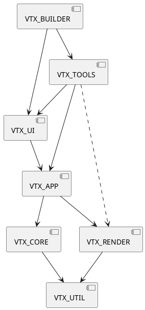

# Architecture VTX

# Intro

Le but de la nouvelle architecture est de décomposer l'architecture actuelle en plusieurs partie pour assurer plus de modularité (Interface / Rendu), tout en conservant une exécution optimale du rendu.
Pour ce faire, nous comptons diviser le projet actuel en plusieurs sous-projet afin d'assurer cette modularité. La découpe en plusieurs projets devrait aussi améliorer le temps de compilation du logiciel.

Pour coller à ces principes (modularité et optimisation), nous allons diviser le code en 4 sous-projets principaux.

- **VTX_CORE** qui contiendra les structures de données pour la description d'une molécule.
- **VTX_RENDER** qui s'occupera de la partie rendue.
- **VTX_APP** qui reliera Core et Render, assurera la cohérence des données dans les structures de **VTX_CORE** et fournira toutes les autres classes et actions permettant l’exécution de fonctionnalités dans VTX
- **VTX_UI** qui fera le lien entre les actions de l'utilisateur et les fonctionnalités de VTX_APP

**VTX_RENDER** et **VTX_UI** pourront être étendue pour intégrer de nouvelles bibliothèques graphiques (Vulkan, Metal (? MoltenVK suffisant ?) et différentes interfaces (Bash, Light, Heavy, Custom)

À ces 4 modules pourront être ajouté 3 modules annexes :

- **VTX_UTIL** (ou VTX_SHARED ?) contiendra un set de structure et de fonctionnalité commun à tous les modules dans le but d'optimiser la communication entre eux (notamment entre **VTX_CORE** et **VTX_RENDER**).
- **VTX_TOOLS** pourra être ajouté et contiendra les différents outils d'analyse, de vidéo et de manipulation dans VTX qui pourront être intégrer (ou non) dans les différentes versions de VTX.
- **VTX_BUILDER** (?) permettra de builder une version de VTX à partir d'un fichier de config définissant le moteur de rendu, le type d'interface et les outils présent dans la build. (Projet séparé ou intégré dans **VTX_UI** ? Ça ne me semble pas terrible car cela implique une inter-dépendance **VTX_UI** et **VTX_TOOLS**)

# Modules

## VTX_CORE

### Description

**VTX_CORE** est composé des structures de données minimales nécessaire pour l'affichage d'une molécule.
Elle contiendra la structure logique des molécules, chaînes, résidus, atomes et liaisons.
Ces structures doivent être simplifiées au maximum et optimisées pour le render (concaténation en mémoire, ...) .

Liste et détail des classes :
- Molécule
    - std::vector\<Chain> _chains
    - std::vector\<Residue> _residues
    - std::vector\<Atom> _atoms
    - std::vector\<std::vector\<Vec3f>> _atomPositionsFrames ¤ (Pour le moment ici. Concatène les positions en mémoire pour optimisation GPU.)
    - std::vector\<Bond> _bonds
    - Mat4f _transform (?) (Présent ici ou dans VTX_APP ?)

- Chain
    - Molecule* _moleculePtr (?) (Présent ici ou dans VTX_APP ?)
    - uint _firstResidueIndex
    - uint _residueCount
    
- Residue
    - Chain * _chainIndex (?) (Présent ici ou dans VTX_APP ?)
    - uint _firstAtomIndex
    - uint _atomCount
    - uint _firstBondIndex
    - uint _bondCount

- Atom
    - Residue * _residuePtr (?) (Présent ici ou dans VTX_APP ?)
    - uint _index (?)
    - SYMBOL (enum int) _symbol
    - Vec4f _positionAndRadius (?) ¤ (Position+radius présent en tant qu'attribut d'atome ou directement dans Molecule ?)
    
- Bond
    - Molecule* _moleculePtr (?) (Présent ici ou dans VTX_APP ?)
    - uint _firstAtom
    - uint _secondAtom
    - BOND_ORDER (enum int) _bondOrder (BOND_ORDER pourrait être enum char si opti car contient peu de valeurs différentes (12))

### ¤ Notes

- *Molecule::_atomPositionsFrames* pourrait être simplement un vecteur de Vec3f et les différentes frames pourraient définies avec un vecteur d'index (ou index, count).
- *Molecule::_atomPositionsFrames* pourrait contenir des Vec4f au lieu de Vec3f pour intégrer le radius de l'atome (opti GPU ?)
- Comment stocker efficacement les frames d'animation (opti mémoire & opti render) ?
- Stocker un identifiant unique pour chaque objet pour le picking ou gérer ça dans VTX_APP ?

### Dépendances

**VTX_CORE** ne dépend que de **VTX_UTIL** pour des soucis d'optimisations (partage de structures avec **VTX_RENDER** pour éviter les conversions Vec3f, Vec4f, Mat4f).

## VTX_RENDER

### Description

**VTX_RENDER** fourni une structure de donnée appropriée pour produire un rendu de molécule et fait l'affichage de celle-ci via la bibliothèque de rendu souhaitée.

**VTX_RENDER** devra exposer une liste de fonction relativement abstraite (à définir à quel point on peut être abstrait) pour pouvoir produire un rendu, produire un snapshot (penser à la watermark) et récupérer une information dans les buffers (ie picking).

Structure de rendu :
- Structure molécule :
    - Geometry (AtomRadius + AtomPositions dans un Vec4f (?) ?, Bonds)
    - Buffers (ModelID (?), Symbol, Color, Selection, Visibility, ...(?)) ¤

- Structure Secondary Structure (?)

- Structure Secondary SES (?)

### ¤ Idées

- Possibilité d'optimiser les données du buffer dans un Vec4f avec la couleur en Vec3f, et le dernier float lu comme un BitArray (Selection, Visibility, autre ?).

- Associer 2 tableaux pour une molécule :
    - Un premier tableau de Vec4f avec position & info complémentaire pour chaque atomes
    - Un second tableau avec le symbol de l'atome pour pouvoir récupérer les informations relative au type d'atome stocké dans une table à part (radius, default_Color, (...) ).

### ¤ Notes

- Gestion des "Render Effects" ? (SSAO, Outline, Fog)
- Gestion des paramètres de la caméra (Near clip & Far clip, Background Color) ?
- Gestion des lights (Global & Spotlights) ?

### Dépendances

**VTX_RENDER** ne dépend que de **VTX_UTIL** pour des soucis d'optimisations (partage de structures avec **VTX_CORE** pour éviter des conversions).

## VTX_APP

### Description

**VTX_APP** va s'occuper de faire le lien entre Core et Render, et fournir aux modules supérieurs différentes classes et actions permettant d’interagir avec l'environnement VTX.

Repenser l'archi en Entity Component System (via EnTT ?).

En plus du lien entre Core et Render, **VTX_APP** devrait contenir tout ce qui a attrait à :
- SES
- SS
- Selection
- Gestion des représentations (preset, etc)
- Gestion des render effects (preset, etc) (?)
- Gestion d'une scène
- Interface de manipulation de la camera
- Actions (+ Undo/redo)
- Events
- Settings
- Sauvegarde / Chargement de scène
- Sauvegarde(?) / Chargement / Téléchargement (?) de molécules
- Gestion des labels (?) (Ici ou dans VTX_TOOLS ?)
- Gestion des viewpoints (?) (Ici ou dans VTX_TOOLS ?)
- Gestion des paths (?) (Ici ou dans VTX_TOOLS ?)

**VTX_APP** pourrait fournir aussi toute une liste d'outils pour le développement de fonctionnalités (reader/writer json, worker/threading, network)

### Dépendances

**VTX_APP** dépend de **VTX_CORE** et de **VTX_RENDER** pour assurer la liaison entre ces deux modules.

## VTX_UI

**VTX_UI** fait l'interface entre l'utilisateur et **VTX_APP**.

La communication entre ces deux modules se fera par le biais d'actions et d'events. **VTX_UI** pourra lancer des actions sur l'ActionManager de **VTX_APP** qui les exécutera. Lorsqu'une structure de **VTX_APP** sera modifiée, elle enverra un event qui pourra être récupéré par les objets de **VTX_UI** qui se mettront à jour en conséquence.

**VTX_UI** propose plusieurs interfaces utilisateur différentes :
- Une interface "Bash" qui ne sera pas graphique et qui prendra que des lignes de commandes en entrée.
- Une interface graphique type Qt (+ Controllers).

L'interface graphique devra définir une partie abstraite pour gérer le layout, et une partie implémentation avec la librairie UI de notre choix (Par exemple Qt).

**VTX_UI** doit exposer tout un set de fonctions pour composer son interface (décrit par un fichier JSON depuis **VTX_BUILDER**) afin de générer des interfaces customisées selon les cas d'utilisation .

Dans cette optique, chaque élément d'interface intégré dans ce module doit être implémenté comme le seront les tools qui pourront venir se greffer à l'interface.

Les éléments intégrés d'office à **VTX_UI** sont :
- Le Controller (Camera et Picking)
- La fenêtre de Render
- La fenêtre de Scene
- La fenêtre d'Inspector
- La Console
- La Fenêtre de Sequence (?)
- La fenêtre de Settings
- La fenêtre d'About
- La gestion de Scene (Nouvelle Scene / Sauvegarde / Chargement)
- La gestion de Molécule (Loading, Download, Export) - (Duplicate, Extract, Delete) - (Show, Hide, Solo) - (Show/Hide Water, Solvent, Ion, Hydrogen)
- La gestion des Représentations
- La gestion des Render Effects
- La gestion des Labels (?)
- La gestion des Viewpoints (?)
- Le Snapshot (?)

### Notes

- La création de ces différentes interfaces pourrait être faite via un fichier de configuration (en JSON) qui décrirait les différentes fonctionnalités qu'on souhaiterait intégrer dans notre build de VTX. Ce fichier de config est géré dans **VTX_BUILDER** pour pouvoir aussi gérer les tools.

### Dépendances

**VTX_UI** dépend de **VTX_APP** pour pouvoir appeler les différentes fonctionnalités exposées par ce dernier.

**VTX_UI** pourrait dépendre de **VTX_RENDER** pour la fonction Snapshot (si l'action Snapshot n'est pas intégrée dans **VTX_APP**).

## VTX_UTIL (ou VTX_SHARED)

**VTX_UTIL** va contenir diverses structures, classes et fonctions communes à tous les modules. Principalement les structures et algo mathématiques, ainsi que les structures de nécessaire au debug.

Liste des classes de VTX_UTIL :
- Exception : Définition des exceptions spécifiques à VTX (? Ici ou dans VTX_APP ?)
- Math
    - Structures
        - uint
        - Vec3f
        - Vec4f
        - Mat4f
        - Color
        - (...)
    - Constant :  Contient diverses constantes mathématiques utiles (Pi, VEC3F_ZERO, etc)
    - Util :  Contient diverses fonctions mathématiques avec les structures précédentes

- Tool
    - Logger
    - Chrono
    

### Dépendances

Par nature, ce module ne doit donc dépendre d'aucun autre module de VTX.
    
## VTX_TOOLS

**VTX_TOOLS** va contenir l'ensemble des outils annexe qui pourront être greffés à VTX via **VTX_UI**.

Afin de limiter le nombre de projet dans la solution VTX, nous allons intégrer l'ensemble des tools dans un même module **VTX_TOOLS**. Il faudra bien partitionner les tools dans des namespaces séparés.

La dépendance entre pourra être envisagée mais il faudra trouvé un bon moyen de gérer ça. (par exemple le tool Measurement qui récupère des données du tool Label, etc).

Pour bien faire, un tool devra être scinder en 2 partie, la partie APP qui contient les données et les fonctions nécessaires au tool, et la partie UI qui implémentera son interface (CommandLine, Qt, ImGUI (?)).

Liste des tools existants:
- Analysis
    - Fenêtre de Séquence (Ici ou dans **VTX_APP** ?)
    - Measurement
        - Distance
        - Angle
        - Dihedral angle
    - RMSD
    - Structural Alignment
- Illustration
    - Label (Ici ou dans **VTX_APP** ?)
    - Viewpoints (Ici ou dans **VTX_APP** ?)
    - Snapshot (Ici ou dans **VTX_APP** ?)

Liste des tools à venir :
- Analysis
    - Measurement
        - Distance to cycle
    - Hydrophobic area
- Video
    - Path
- (...)

### Note 

### Dépendances

**VTX_TOOLS** dépend de **VTX_UI** pour implémenter son interface, et potentiellement de **VTX_APP** et de **VTX_RENDER** selon les outils.

## VTX_BUILDER (?)

(Module à part entière ?) **VTX_BUILDER** est un module qui doit pouvoir builder une version de VTX à partir d'un fichier de config.
Il dépend de tout. C'est la pièce la plus haut niveau du logiciel.

Le fichier de config doit spécifier la plateforme cible (PC, Mac, Linux) (? Défini quand on build plutôt ?), la bibliothèque de rendu à utiliser (choisi automatiquement selon plateforme cible ?), l'interface (CommandLine, Qt, ImGUI), les différents tools présents.
Ce doit être le point d'entrée de l’exécutable et le projet courant par défaut dans Visual Studio.

Prévoir plusieurs fichier de config par défaut :
- VTX : Interface de release avec tout les outils voulus.
- VTX Lite : Interface minimale pour les tests de perfs graphiques, et l'utilisation dans les TP CG.
- Bash : Pas d'interface graphique, ni de rendu. Utilisé pour faire des calculs ou des exports programmés uniquement. (Build séparée ?)

Autres fichiers de config probable :
- VTX Dev : Interface avec un (ou plusieurs) outils en cours de développement.
- VTX Qubit : Interface avec seulement les outils intéressant Qubit.

### Note 

### Dépendances

**VTX_BUILDER** dépend de **VTX_UI** et **VTX_TOOLS** pour builder une version de VTX.

## Schéma des dépendances

