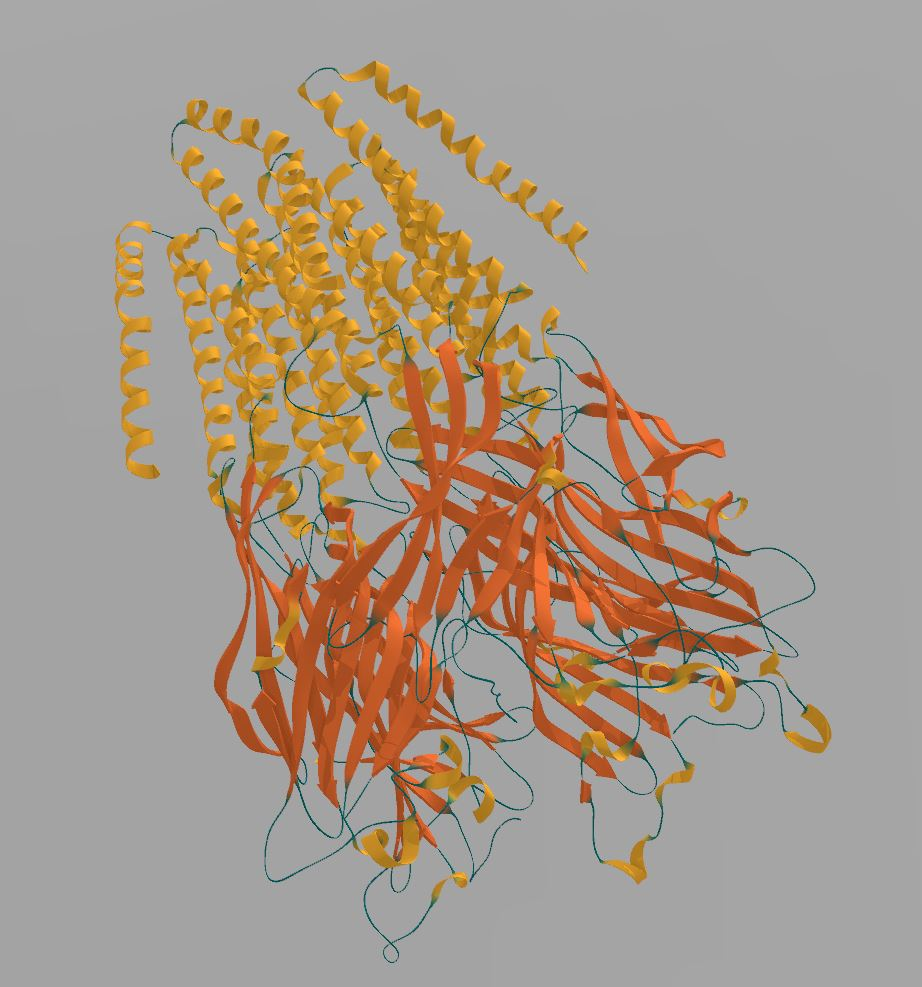

# CPPCartoon

This is a tool to generate meshes of a cartoon for secondary structure of proteins.

Can be used as a library by calling `computeCartoonMesh` or as a standalone tool by calling the executable on a PDB file (see Example).

-----------------------------------

Secondary structure type code : `0 = COIL / 1 = HELIX / 2 = STRAND`

------------------------------------

- Example for the executable: ```./cppCartoon 1kx2.pdb output.obj```

- Example for the library : ```computeCartoonMesh(numberOfChains, (int *)numberOfResiduePerChain, (float *)CA_O_Positions, (char *)ssTypePerResidue);```

- `CA_O_Positions`: The function expects 3 `float` + 3 `float` for each residue : one alpha carbon position and one oxygen position per residue

-----------------------------------

- OpenMP is used to compute each chain in parallel

- PDBs are parsed using CPDB parser : https://github.com/vegadj/cpdb

- This code is based on the algorithm from https://github.com/fogleman/ribbon

---------------------------------





---------------------------------


[](https://opensource.org/licenses/MIT)
