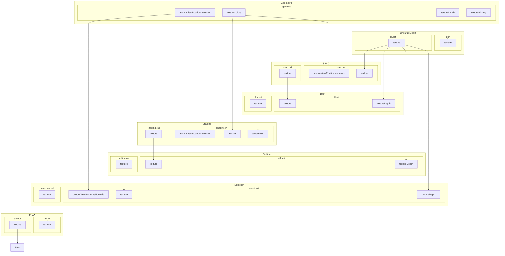

```mermaid
  flowchart TD
    subgraph Geometric
      subgraph geo.out
        geo.out.textVPN[textureViewPositionsNormals]
        geo.out.textColors[textureColors]
        geo.out.textDepth[textureDepth]
        geo.out.textPicking[texturePicking]
      end
    end
    subgraph LinearizeDepth      
      subgraph ld.in
        ld.in.text[texture]
      end
      subgraph ld.out
        ld.out.text[texture]
      end
    end
    subgraph SSAO
      subgraph ssao.in
        ssao.in.textVPN[textureViewPositionsNormals]
        ssao.in.textDepth[texture]
      end
      subgraph ssao.out
        ssao.out.text[texture]
      end
    end
    subgraph Blur
      subgraph blur.in
        blur.in.text[texture]
        blur.in.textDepth[textureDepth]
      end
      subgraph blur.out
        blur.out.text[texture]
      end
    end
    subgraph Shading
      subgraph shading.in
        shading.in.textVPN[textureViewPositionsNormals]
        shading.in.text[texture]        
        shading.in.textBlur[textureBlur]     
      end
      subgraph shading.out
        shading.out.text[texture]
      end
    end
    subgraph Outline
      subgraph outline.in
        outline.in.text[texture]
        outline.in.textDepth[textureDepth]        
      end
      subgraph outline.out
        outline.out.text[texture]
      end
    end
    subgraph Selection
      subgraph selection.in
        selection.in.textVPN[textureViewPositionsNormals]
        selection.in.text[texture]
        selection.in.textDepth[textureDepth]
      end
      subgraph selection.out
        selection.out.text[texture]
      end
    end
     subgraph FXAA
      subgraph aa.in
        aa.in.text[texture]
      end
      subgraph aa.out
        aa.out.text[texture]
      end
    end

    geo.out.textDepth --> ld.in.text

    geo.out.textVPN --> ssao.in.textVPN
    ld.out.text --> ssao.in.textDepth

    ssao.out.text --> blur.in.text
    ld.out.text --> blur.in.textDepth

    geo.out.textVPN --> shading.in.textVPN
    geo.out.textColors --> shading.in.text   
    blur.out.text --> shading.in.textBlur

    ld.out.text --> outline.in.textDepth
    shading.out.text --> outline.in.text

    geo.out.textVPN --> selection.in.textVPN
    outline.out.text --> selection.in.text
    ld.out.text --> selection.in.textDepth

    selection.out.text --> aa.in.text

    aa.out.text --> FBO
```

